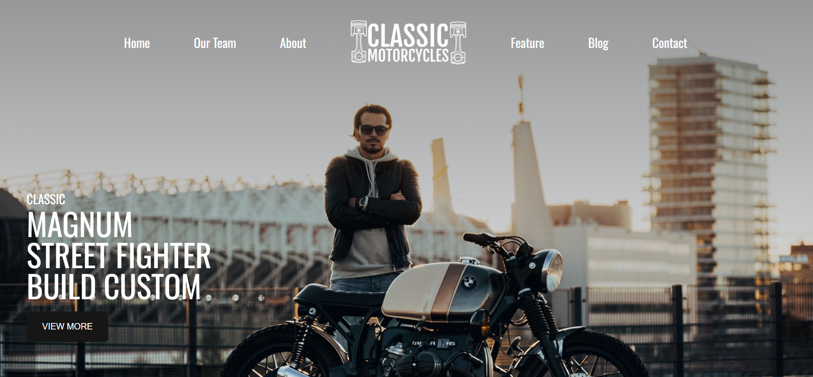

# 🏍️ Classic Motorcycles – Vintage Bike Showcase Website  



**Classic Motorcycles** is a visually rich and immersive **vintage motorcycle showcase website** built for bike enthusiasts and custom builders.  
The website celebrates classic bikes, custom builds, workshops, blogs, and biker culture with a bold design and smooth animations.  
Developed using **HTML**, **CSS**, and **JavaScript**, this project focuses on **storytelling**, **visual appeal**, and **responsive layout**.

---

## ✨ Features  

- 🏠 **Home Section** — Bold hero section highlighting classic motorcycle culture.  
- 👥 **Our Team & Services Banner** — Showcases workshops, custom builds, and repairs.  
- ℹ️ **About Us Section** — Story-driven introduction to classic motorcycle passion.  
- 🎥 **Featured Video Section** — Autoplay video highlighting bike journeys and builds.  
- 📰 **Blog Section** — Latest blogs with dates and comment counts.  
- 📸 **Instagram Gallery** — Grid layout for social media showcase.  
- 📞 **Footer Section** — Newsletter signup, contact details, and social links.  
- 📱 **Responsive Design** — Works seamlessly on all devices.  

---

## 🖼 Demo  

👉 **Live Demo:** [Click Here](#)  

---

## 🛠️ Tech Stack  

- **HTML5** — semantic and structured markup  
- **CSS3** — custom layouts, animations, and responsive styling  
- **JavaScript (ES6)** — navigation and scroll interactions  
- **Remix Icon** — modern icon set  
- **ScrollReveal.js** — smooth scroll animations  

---

## ⚙️ How to Use  

1. **Clone the repository**
   ```bash
   git clone https://github.com/fsafiya187/Classic-Motorcycles.git

2. **Navigate to the project folder**

cd Classic-Motorcycles

3. **Open the project**

Open index.html in your browser

---

## 📚 Learning Highlights

Designing a bold, brand-focused landing page.

Building responsive multi-section layouts.

Integrating videos into web pages.

Using ScrollReveal for smooth UI animations.

Creating visually engaging blog and gallery sections.

---

## 🧾 License

This project is open-source and available under the MIT License.

---

## 💬 Author

Safiya Fathima
🌐 GitHub: fsafiya187